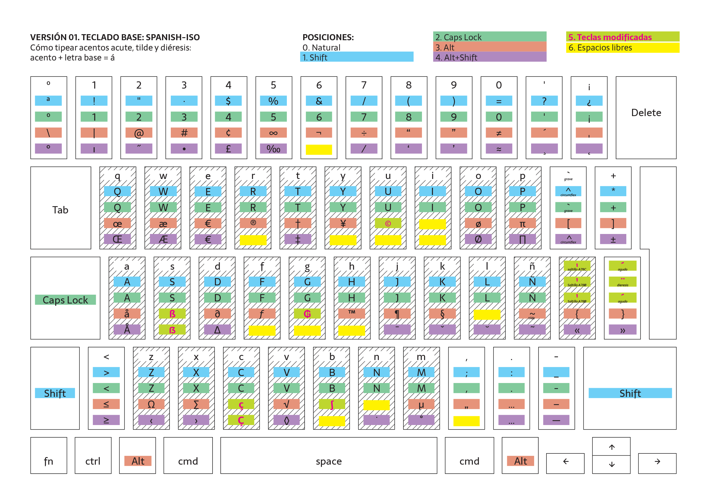

[English](README-en.md)

# Teclado Guaraní
Distribución de teclado Guaraní-Español-Portugués

El objetivo de esta nueva propuesta de distribución de teclado es brindar accesibilidad a los signos necesarios para tipear guaraní y español.
Tomando como base la distribución Spanish - ISO y modificándola lo menos posible hemos incorporado:

`y` + `´`

`e` `i` `u` `y` `g` + `~`

`saltillo` ⁄ `pusó`

`Gtilde` / `gtilde` -> no tienen unicode, pero se pueden tipear usando  el acento de combinación.

`Saltillo` / `saltillo` -> tienen unicode. Es una letra, por lo que debería ser de tipeado directo y estar dentro de la órbita de las letras. Tiene low- y uppercap.

Con esta distribución queremos ofrecer una solución a la escritura guaraní independientemente de la fuente tipográfica que se esté utilizando (cualquier fuente que contenga combining accents debería funcionar).
Es importante considerar a un usuario bilingüe porque el guaraní es un idioma que comparte territorio con otros idiomas, principalmente español y portugués.

El programa utilizado para generar esta nueva distribución es Ukelele:

http://scripts.sil.org/cms/scripts/page.php?item_id=ukelele

https://support.microsoft.com/es-ar/help/258824/how-to-change-your-keyboard-layout

https://glyphsapp.com/tutorials/mark-attachment

https://es.wikipedia.org/wiki/Distribuci%C3%B3n_del_teclado#Teclado_est.C3.A1ndar_multiidiomas_de_Canad.C3.A1